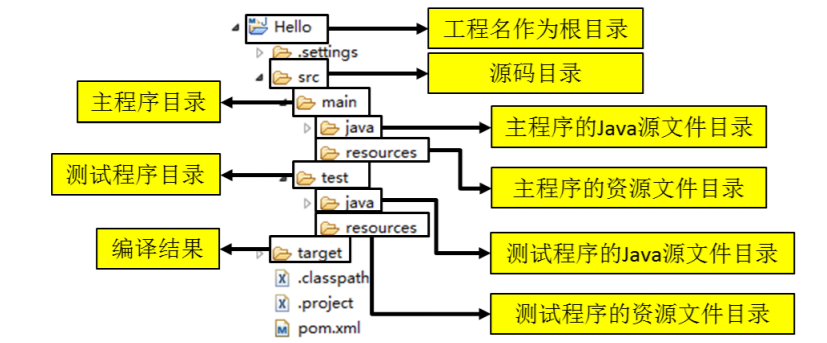

# Maven

## Maven的介绍与安装
    1. 在传统的项目构建中存在的问题
        <1> 一个项目就是一个工程
            * 如果项目非常庞大，就不适合使用package继续划分模块。最好是每一个模块对应一个工程，利于分工协作

        <2> 项目中的jar包需要手动复制到WEB-INF/lib目录中
            * 问题：同样的jar包出现在不同的项目工程，浪费内存，工程比较臃肿

            * 借助Maven可以将jar包仅仅保存在“仓库”中，只需要使用“引用”文件接口即可

        <3> jar包需要准备好，或者去官网下载
            * 借助Maven可以以一种规范的模式下载jar包。基本都存储在Maven的中央仓库

        <4> 一个jar包依赖的其他jar包需要自己手动添加到项目中
            * Maven会自动将依赖的jar包导入
            
    2. Maven是什么
        <1> 概念：maven是一个项目管理工具，它包含了一个项目对象模型（POM：Project Object Model），一组标准集合，一个
                 项目生命周期，一个依赖管理系统，和用来运行定义在生命周期阶段中插件目标的逻辑。

        <2> Maven是一个服务于Java平台的自动化构建工具
            Make -> Ant -> Maven -> Gradle

        <3> 构建
            1) 概念：是以“Java源文件”、“框架配置文件”、“JSP”、“HTML”、“图片”等资源为“原材料”，去生产一个可以运行的项
                    目的过程
                
                * 编译 -> 部署 -> 搭建

                * 编译：指将java源文件编译成字节码文件

                * 部署：一个BS项目最终运行的并不是动态Web工程本身，而是这个动态项目编译的结果

                    - 在开发过程中，所有的路径或者配置文件中配置的类路径都是以编译的结果的目录结构为标准的

            2) 构建的各个环节
                [1]清理：将以前编译得到的字节码文件删除，为下一次编译做准备

                [2]编译：将Java源代码编译成字节码文件

                [3]测试：自动测试，自动调用junit程序

                [4]报告：测试程序的执行结果

                [5]打包：动态web工程打包成war包，Java工程打包成jar包

                [6]安装：Maven特定的概念---将打包的到的文件复制到仓库中指定的位置

                [7]部署：将动态web工程生成的war包复制到Servlet容器的指定目录下，使其可以运行
    
    3. 安装Maven核心程序
        <1> 检查JAVA_HOME环境变量(maven运行也依赖JAVA_HOME)
            * 输入cmd命令：echo %JAVA_HOME%

        <2> 解压Maven核心程序的压缩包，需要在一个无中文与空格的路径下

        <3> 环境变量的配置：
            * 控制面板 => 高级系统设置 => 环境变量 => 新建MAVEN_HOME(并将安装目录的路径存入变量值) => path进行
              环境变量配置（%MAVEN_HOME%\bin）

            * 可以是MAVEN_HOME或者M2_HOME

        <4> 检验安装是否成功：在cmd命令下输入：mvn -v

        <5> 安装目录解析
           * bin：其中的mvn命令用于构建项目

           * boot：maven运行所需要的类加载器

           * conf：配置文件目录，其中settings.xml是主要使用的配置文件

           * lib：运行所依赖的jar包（有tomcat插件等）

## Maven的核心概念解析

    1. Maven的核心概念
        * Maven的标准目录结构

        * POM

        * 坐标

        * 依赖

        * 仓库

        * 生命周期/插件/目标

        * 继承

        * 聚合

    2. maven项目的标准目录结构
        <1> Maven的标准目录结构：
            * Maven工程名：根目录

            * 核心代码部分：src/main/java目录

            * 配置文件部分：src/main/resources目录

            * 测试代码部分：src/test/java目录

            * 测试配置文件：src/test/resources目录
            
            * 页面资源部分：src/main/webapp目录（存放js，css，图片等）

            * Maven的核心配置文件：pom.xml

        <2> 补充：
            在执行了Maven命令后在生成Maven项目目录（含有pom.xml）下生成一个target文件夹，里面存放了各个命令执行后
            的结果

            2) 为什么要遵循约定的目录结构
                * Maven需要负责项目的自动化构建，以编译为例，Maven如果想要自动编译，那么就需要知道Java的源文件在哪

                * 如果自定义内容需要让框架与工具知道，有两种方式
                    - 以配置方式明确告诉框架

                    - 遵循内部已经存在的约定

                * 注意：约定 > 配置 > 编码

    3. 常用Maven命令
        <1> 注意：执行与构建过程相关的Maven命令，必须进入到pom.xml所在的目录
            * 与构建相关：编译、测试、打包等

        <2> 常用命令
            * mvn clean ：删除target目录(清理)
                     本质：将编译好的项目中的信息删除。
                     作用：在接手他人项目时要先将这个编译好的信息删除，因为开发环境可能不同

            * mvn compile：编译主程序，将Maven项目中src/main/java下的代码进行编译，放置在target目录下

            * mvn test-compile：编译测试程序

            * mvn test：执行测试，编译src/test/java下的代码，存放于target/test_classes
                        注意：这个命令不仅编译了src/test/java的代码，也会编译src/main/java下的代码

            * mvn package：打包项目。同样也将打包后的项目放在target目录下，并且打包成war格式（在配置文件settings.xml
                           中指定了war），打包之前会将核心代码和测试代码都编译

            * mvn install：安装。相当于执行一次打包命令，然后将打包的文件安装到本地仓库

            * mvn site：生成站点

    4. 关于联网的问题
        <1> Maven的核心程序中仅仅定义了抽象的生命周期，但具体的工作必须由特定的插件来完成。而插件本身并不在Maven的核心
            程序中

        <2> 当我们执行的Maven命令需要用到某些插件时，Maven核心程序会首先到本地仓库中查找

        <3> 本地仓库的默认位置：系统当前用户的根目录\.m2\respository
            * 例如：在我的电脑中就是：C:\Users\asus\.m2\repository

        <4> Maven核心程序如果在本地仓库中找不到需要的插件，那么就会自动连接外网，到中央仓库去下载

        <5> 如果此时无法连接外网，则构建失败

        <6> 修改默认本地仓库的位置可以让Maven到我们指定的仓库去查找插件
            1) 找到Maven的解压目录\conf\settings.xml

            2) 在该文件中找到localRespository标签

            3) 该标签在注释中，需要取出，然后再指定仓库

            4) 如：在我的电脑中是D:\program\maven_warehouse

    5. POM
        <1> 含义：Project Object Model：项目对象模型

        <2> pom.xml是Maven工程的核心配置文件，与构建过程相关的一切设置都在这个文件中进行配置

    6. 坐标
        <1> 几何中的坐标
            1) 在一个平面中使用 x、y 两个向量可以唯一的确定平面中的一个点。

            2) 在空间中使用 x、y、z 三个向量可以唯一的确定空间中的一个点。

        <2> Maven中的坐标
            <1> 使用如下三个向量在 Maven 的仓库中唯一的确定一个Maven工程。通常gav就是指这三个坐标
                1) groupid：公司或组织的域名倒序+当前项目名称

                2) artifactId：当前项目的模块名称

                3) version：当前模块的版本

            <2> 如：下面坐标就定义了一个标准的Maven工程
                * 也就是：com/arbonkeep/maven/Hello-0.0.1-SNAPSHOT.jar

    7. 仓库
        <1> 分类
            1) 本地仓库：为当前本机电脑上的所有 Maven 工程服务。

            2) 远程仓库
                * 私服：架设在当前局域网环境下，为当前局域网范围内的所有 Maven 工程服务。

                * 中央仓库：架设在 Internet 上，为全世界所有 Maven 工程服务。

                * 中央仓库的镜像：架设在各个大洲，为中央仓库分担流量。减轻中央仓库的压力，同时更快的

        <2> 仓库中的文件
            * Maven 的插件

            * 我们自己开发的项目的模块

            * 第三方框架或工具的jar包
            
        <3> 不管是什么样的jar包，在仓库中都是按照坐标生成目录结构，所以可以通过统一的方式查询或依赖。

    8. 依赖
        <1> Maven解析依赖信息时会到本地仓库去查找被依赖的jar包
           
           * 对于我们自己开发的Maven工程，使用mvn install命令安装后就可以进入仓库

        <2> 依赖的范围

            1) compile范围依赖
                * 对主程序是否有效：有效
                * 对测试程序是否有效：有效
                * 是否参与打包：参与
                * 是否参与部署：参与
                * 典型例子：spring-core

            2) test范围依赖
                * 对主程序是否有效：无效
                * 对测试程序是否有效：有效
                * 是否参与打包：不参与
                * 是否参与部署：不参与
                * 典型例子：junit

            3) provided范围依赖
                * 对主程序是否有效：有效
                * 对测试程序是否有效：有效
                * 是否参与打包：不参与
                * 是否参与部署：不参与
                * 典型例子：servlet-api.jar

        <3> 依赖的传递性
            1) 表现:当我们创建的项目A依赖x.jar时，如果我们在Maven项目中添加了对应的依赖，那么在同一工Maven程下的其它项
                    目也同样对应的会添加x.jar的依赖

            2) 好处：可以传递的依赖不必在每个模块工程中都重复声明，在"最下面"的工程中依赖一次即可

            3) 注意：非compile范围的依赖不能够传递

        <4> 依赖的排除
            1) 依赖排除的场合：当我们使用某个依赖的jar包(如：a.jar)所依赖的另一个jar包(b.jar),如果不想b.jar加入当前工
                             程，那么就排除b.jar

            2) 依赖排除的方式：在pom.xml中的<dependency>下添加下面代码
                
                exclusions>
                    <exclusion>
                        <groupId>commons-logging</groupId>
                        <artifactId>commons-logging</artifactId>
                    </exclusion>
                </exclusions> 

        <5> 依赖的原则：解决jar包冲突
            1) 验证路径最短优先原则
                * 如下图所示，MakeFriends 依赖 HelloFriends，HelloFriend依赖log4j1.2.14 和 Hello，Hello依赖
                  log4j1.2.17，那么MakeFriends就会依赖log4j1.2.14，这就是最短路径优先

            2) 验证路径相同时先声明者(指的是dependency声明顺序)优先

        <6> 统一管理所依赖jar包的版本
            * 一般要求同一个框架一组jar包使用同一个版本，可以使用以下方式来确保版本一致

                1) 统一声明版本号

                2) 引用前面声明的版本号 

    9. 生命周期
        <1> 生命周期的说明
            1) 三个生命周期：
                * 清理生命周期(Clean Lifecycle):在进行真正的构建之前进行一些清理工作。
                                清理项目编译信息：mvn clean
            
                * 默认生命周期( Default Lifecycle):构建的核心部分，编译，测试，打包，安装，部署等等。
                                编译：mvn compile
                                测试：mvn test
                                打包：mvn package
                                安装：mvn install
                                发布：mvn deploy
                    - 注意：每执行后面的命令前面的都会执行（这是由生命周期决定的）

                * 站点生命周期(Site Lifecycle): 生成项目报告，站点，发布站点。

        <2> 各个环节执行的顺序：不能打乱顺序，必须按照既定的正确的顺序来执行

        <3> Maven的核心程序中定义了抽象的生命周期，生命周期中各个阶段的具体任务是由插件来完成的

        <4> Maven核心程序为了更好实现自动化构建，按照这一特点执行生命周期的各个阶段：不论现在要执行生命周期的哪一个阶段
            都是从这个生命周期的最初的位置开始执行的

        <5> 插件和目标
            1) 生命周期的各个阶段仅仅定义了要执行的任务时什么

            2) 各个阶段和插件目标是对应的

            3) 相似的目标是由对应的插件完成的

    10. 继承(其中父工程为Parent，子工程为Hello等)
        <1> 现状(三个web工程依赖的jar版本)

            Hello依赖的junit : 4.0
            HellFriend依赖的junit : 4.0
            MakeFriends依赖的junit : 4.9
        
            * 分析：由于test范围的依赖不能传递,所以必然会分散在各个模块工程中,很容易造成版本不一致。

        <2> 需求:统-管理各个模块工程中对junit依赖的版本

        <3> 解决思路:将junit依赖统一提取到"父”工程中,在子工程中声明junit依赖时不指定版本,以父工程中统一设定的为准

        <4> 操作步骤    
            1) 创建一个Maven工程作为父工程。 注意:打包的方式pom

            2) 在子工程中声明对父工程的引用

            3) 将子工程的坐标中与父工程坐标中重复的内容删除

            4) 在父工程中统一junit的依赖

            5) 在子工程中删除junit依赖的版本号部分(如果保留了，那么版本就是保留的版本)

        <5> 配置了继承之后，在执行mvn install命令时需要先安装父工程

    11. 聚合
        <1> 作用：一键安装各个模块工程

        <2> 配置方式:在一个“总的聚合工程中”配置各个参与聚合的模块

        <3> 为什么要使用聚合？
            将多个工程拆分为模块后，需要手动逐个安装到仓库后依赖才能够生效。修改源码后也需要逐个手动进行 clean 操作。
            使用了聚合之后就可以批量进行 Maven 工程的安装、清理工作。

        <4> 如何配置聚合？
            在总的聚合工程中使用 modules/module 标签组合，指定模块工程的相对路径即可

