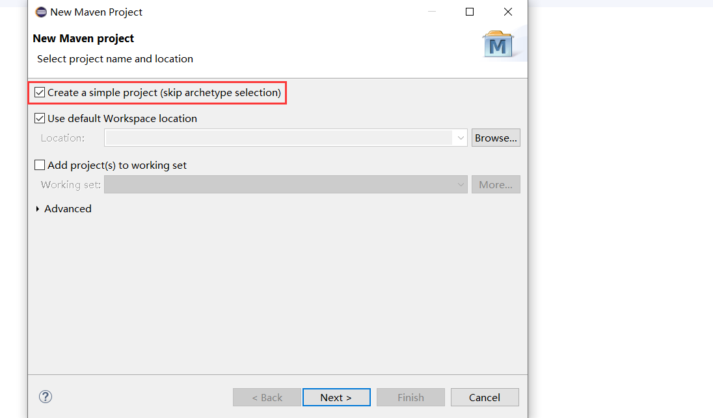
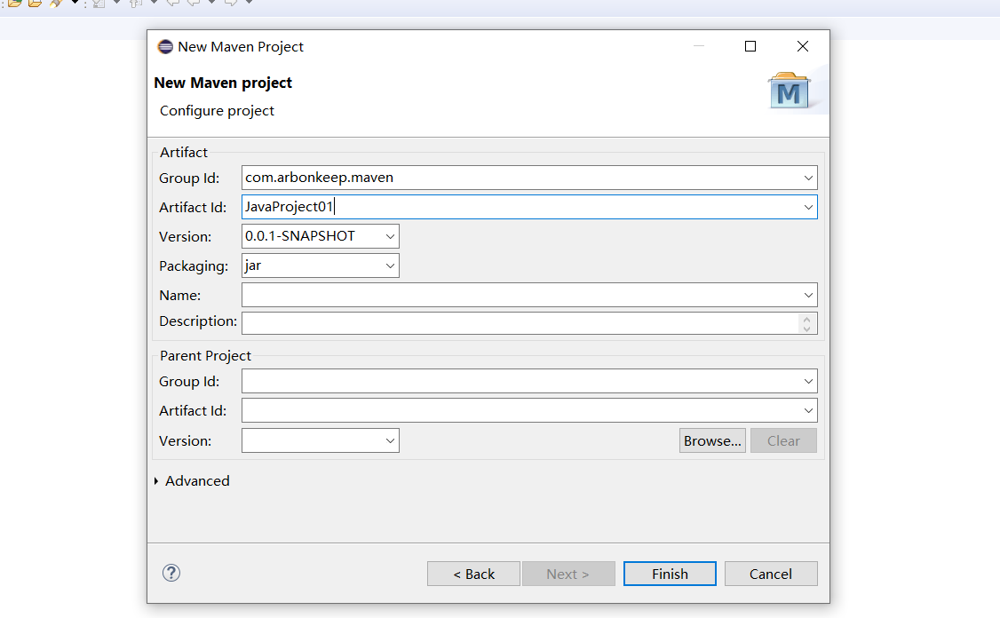
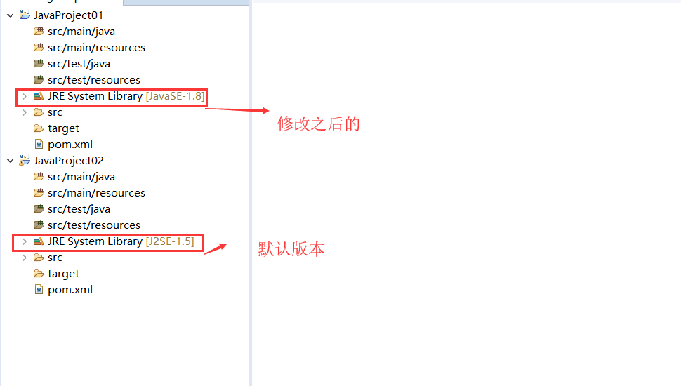
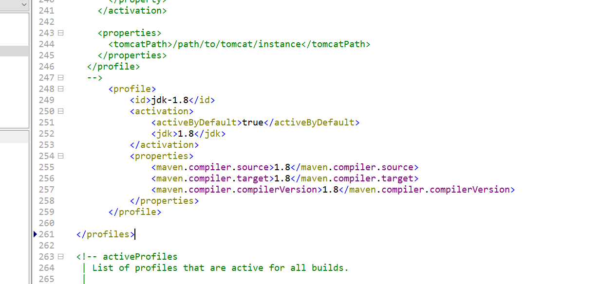
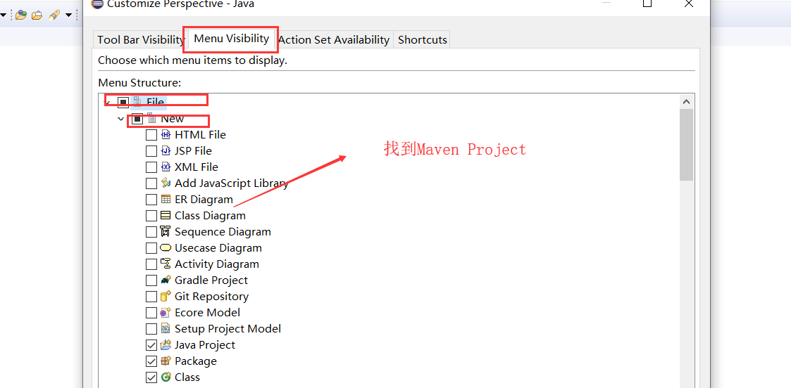
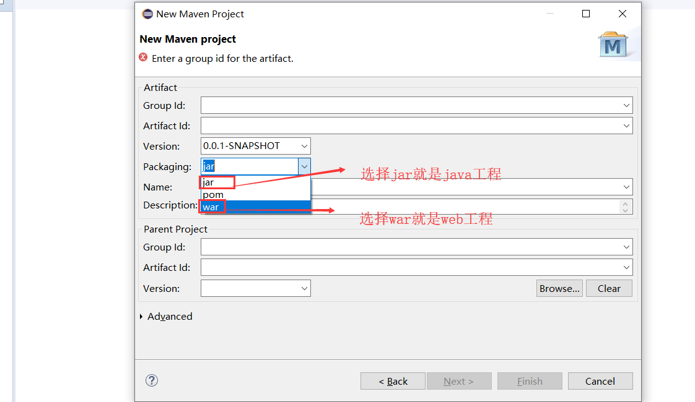
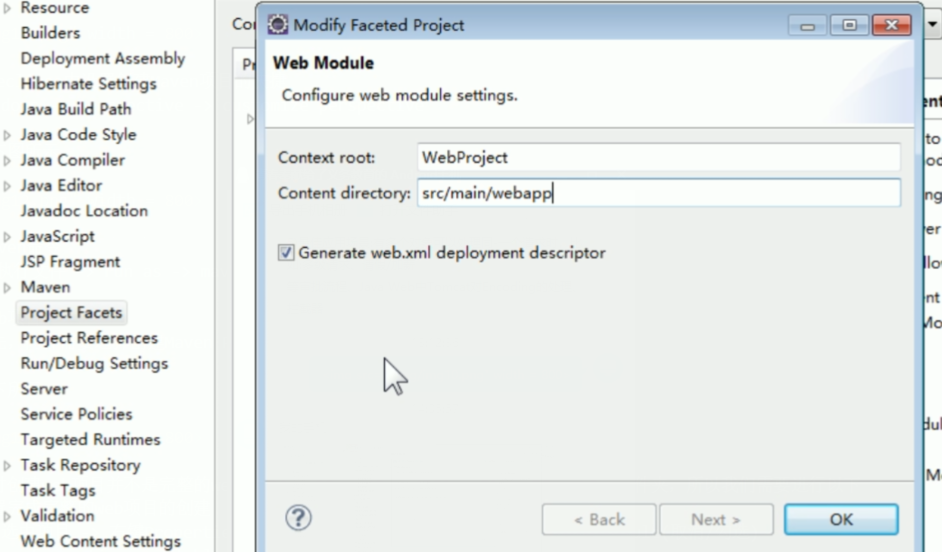
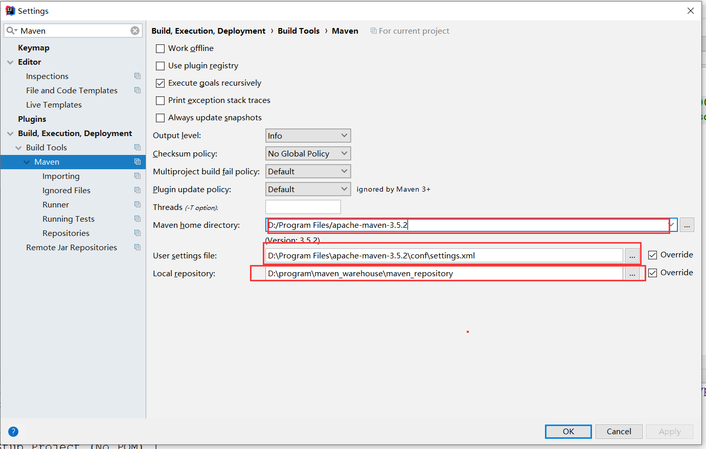

# Maven

## Maven的使用

### Maven在Eclipse中使用
     1. Maven在Eclipse中使用
        <1> 插件设置(在首选项中找到Maven)
            1) installations：指定核心程序的位置。建议使用自己解压的Maven，不要使用默认的

            2) user settings：指定conf/settings.xml位置，进而获取本地仓库位置

            3) 基本操作
                * 创建Maven版的java与java web工程

        <2> 创建Java工程
            * 创建Maven工程时，需要勾选下面内容，没有勾选的话，就可以选择骨架来创建Maven工程

            * 然后需要填写以下内容

            * 然后完成创建，创建之后，Eclipse中默认是jdk1.5，我们需要修改依赖为需要的jdk版本

            * 我们可以通过以下方式完成一键修改（以后创建Maven就不再需要重新修改jdk版本）
                [1]打开settings.xml文件
                [2]找到profiles标签
                [3]加入如下配置
                    <profile>
                        <id>jdk-1.7</id>
                        <activation>
                            <activeByDefault>true</activeByDefault>
                            <jdk>1.7</jdk>
                        </activation>
                        <properties>
                            <maven.compiler.source>1.7</maven.compiler.source>
                            <maven.compiler.target>1.7</maven.compiler.target>
                            <maven.compiler.compilerVersion>1.7</maven.compiler.compilerVersion>
                        </properties>
                    </profile>   

                [4]如果是jdk1.8，需要高版本的maven来进行配置    

        <3> 如何在eclipse中设置创建Maven项目的快捷
            1) windows -> perspective -> customize perspective

            2) 如下图所示

        <4> 执行Maven命令
            选中可执行文件 -> run as -> maven命令(6个)

        <5> 创建Web项目
            1) 首先，同样需要选择创建Maven Project，勾选Create。。。

            2) 如下所示

            3) 此时创建web项目并不是完整的web项目，对于java项目而言只是多了一个webapp的文件夹，所以我们需要进行以下
               设置完成完整的web项目的创建
                * 选中项目 -> 右键Properties -> 选择Project Facets -> Dynamic Web Module(取消/勾选) ->
                  confugaration available 

### Maven在Idea中的使用

    1. idea集成maven插件
        <1> idea => settings => 搜索maven => 在Maven home directory中找到本地安装的maven路径 

        <2> 在User Settings file中找到maven的配置文件目录（maven安装目录下/conf/settings.xml）(注意：选中后下面会
            自动指定本地仓库的路径)

        <3> 在maven找到 Runner =>VM Option(配置:-DarchetypeCatalog=internal 意思是在没有联网的情况下能够创建maven
            工程)

    
    2. 创建maven工程

        * 使用骨架创建java的工程
            步骤：
                <1> 创建Maven项目中勾选Create from artchetype 选用下面骨架：quickstart（maven提供的创建java工程的
                    骨架）
                <2> 指定当前所在项目的坐标 GroupId（公司组织名称的id） AtifactId（当前项目名称） Version
                。。。

        * 不使用骨架创建java工程(推荐)
            步骤；  
                <1> 直接创建Maven项目
                <2> 指定当前所在项目的坐标 GroupId（公司组织名称的id） AtifactId（当前项目名称） Version
                。。。

        * 使用骨架创建maven的web工程
            步骤：
                <1> 创建maven 项目中勾选Create from artchetype 选用下面骨架：webapp（maven提供的创建web项目的骨架）
                <2> 指定当前所在项目的坐标 GroupId（公司组织名称的id） AtifactId（当前项目名称） Version

            注意：需要手动补齐macen的结构目录
                    补充正式代码的目录：在main下创建java目录 => 右键Mark Directory As => Sources Root
    
    3. maven中跳转servlet
        * 配置右键创建文件时，没有指定文件类型(jsp)的方式：
            <1> 右键 => Project Structrue... => Modles => 选中项目名称目录下面的web => 将要在哪里创建该文件类型的
                目录添加到 Web Resource Directories 

        * 网络上搜索jar包
            搜索maven中央仓库 => 搜索需要的jar包

        * 在IDEA中如何调出maven中的maven projects中的执行命令窗口
            <1> 点击在最左下角的小框
            <2> 点击菜单栏View->Tool  Windows->Maven projects

    4. maven中如何让修改工程运行环境
        * 修改tomcat服务器插件
            <1> 打开pom.xml，在build下的plugins配
            <2> 配置
                <plugin>
                <groupId>org.apache.tomcat.maven</groupId>
                <artifactId>tomcat7-maven-plugin</artifactId>
                <version>2.2</version>
                <configuration>
                    <port>8888</port>
                </configuration>
                </plugin>

        * 配置jdk插件
            <1> 打开pom.xml，在build下的plugins配置
            <2> 配置
                <plugin>
                <groupId>org.apache.maven.plugins</groupId>
                <artifactId>maven-compiler-plugin</artifactId>
                <configuration>
                    <target>1.8</target>
                    <source>1.8</source>
                    <encoding>utf-8</encoding>
                </configuration>
                </plugin>

        * 配置动态模板
            <1> 打开file => settings => 搜索live template => 添加动态模版(+) => 创建动态模板组(template group) =>
                选中组创建模板(live tempate)

            <2> 在template text中定义内容 => 在Define选择可使用的地方 => 使用：输入模板名，回车即可

     